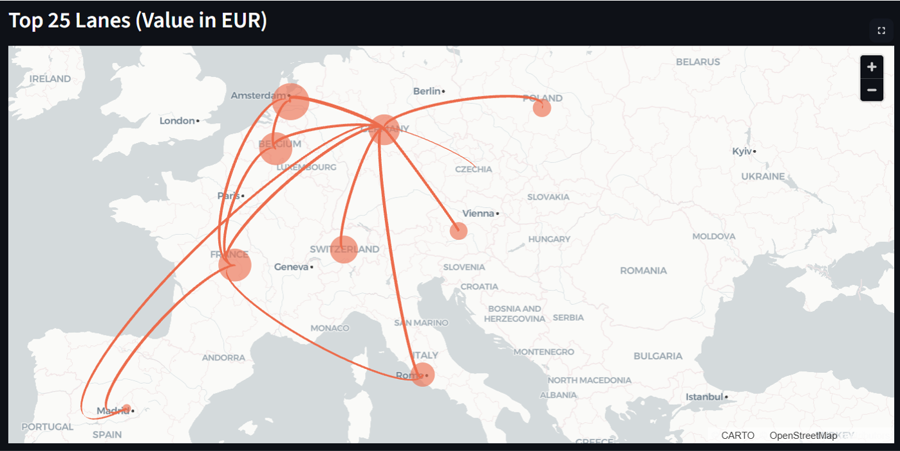

# European Export Lanes Visualization

A Streamlit application for visualizing the largest export lanes in Europe with interactive filtering and 3D map visualization.
App link: https://flow-map-app-lktstbxvu3f5ckzhuqudfm.streamlit.app/

## Features

- Interactive filtering by origin and destination countries
- Sector-based filtering for origin and destination sectors
- Adjustable number of top flows to display (1-50)
- 3D map visualization with flow lines and destination bubbles
- Real-time data loading from Google Drive
- Optimized bubble sizing with square root scaling
- Clean, minimal arc styling for better readability

## Example

Here is an example of the app in action:

## Data Sources

The application uses three main datasets:
- `flatfile_eu-ic-io_ind-by-ind_23ed_2021.csv` - Main trade flow data
- `Map of routes data.csv` - Country coordinates for mapping
- `nace.csv` - Sector classification data

All data is automatically downloaded from a public Google Drive folder on first run.

## Requirements

- Python 3.7+
- streamlit
- pandas
- numpy
- pydeck
- gdown
- openpyxl

## Installation

1. Clone this repository
2. Install dependencies: `pip install -r requirements.txt`
3. Run the app: `streamlit run app.py`

## Deployment

This app is designed to be deployed on Streamlit Cloud. The data files are automatically downloaded from Google Drive on first run and cached for subsequent uses.

## Usage

1. Use the sidebar filters to select origin countries, destination countries, and sectors
2. Adjust the number of top flows to display using the number input
3. Explore the interactive 3D map showing trade flows as arcs and destinations as bubbles
4. Hover over elements for detailed information
5. View summary statistics and top flows table below the map

## Technical Details

- Uses PyDeck for 3D map visualization
- Implements smart flow selection algorithm
- Excludes domestic flows (same origin and destination)
- Bubble sizes reflect total imports per destination for selected sectors
- Arc thickness represents flow value with logarithmic scaling
- Square root scaling for bubble sizes to reduce sensitivity to value differences

